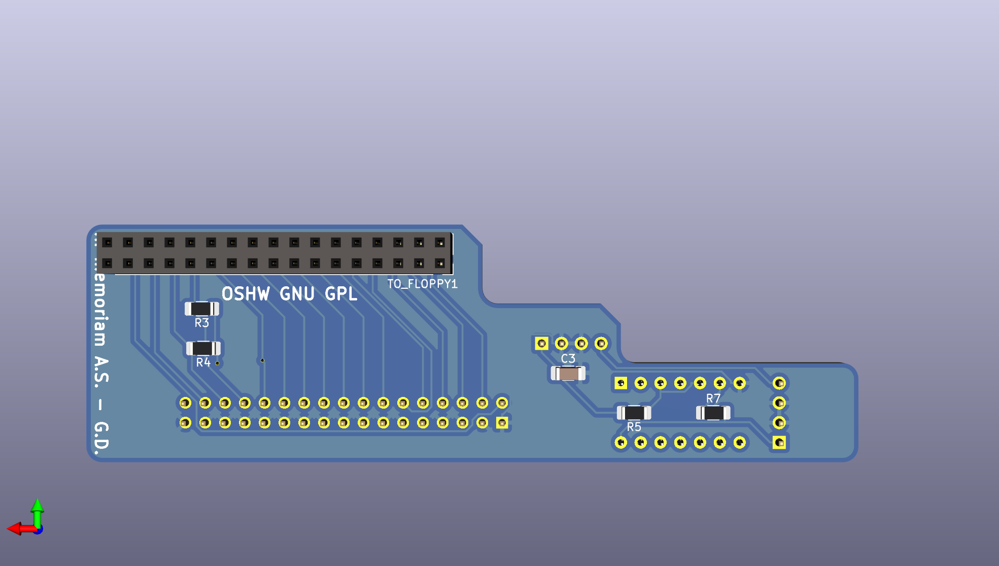

# Amiga Floppy to PC Floppy Adapter
Created by Gianluca Renzi (C) 2018
E-Mail:
<icjtqr@gmail.com>
<gianlucarenzi@eurek.it>

# PCB Revision History
V0.1 Initial Revision 2018 Made with Kicad 4.x
V1.0 First (BAD) PCB revision from transition from Kicad 4.x to Kicad 5.x
V2.0 PCB Revision entirely made on Kicad 5. No library from Kicad 4 anymore.

# What is it?
It is a simple but powerful adapter to use internally in any Amiga Computer!
It must be connected to the floppy disk drive 34-pin interface on the drive
itself, then hooked up with the original cables from Amiga motherboard.

# Images

# Whats changed?
V0.1 Initial release (2018)
V1.0 From Kicad 4 to Kicad 5 (2019)
Found a bug in PCB version automatically generated by Kicad 5 from Kicad 4:
All the hand soldering pads are way too large and they are overlapping each other
short-circuiting every signal with a large series of resistors.
Thanks to: Stefan Gammelgaard(BM) to point me out on this issue.

V2.0 Updated and Corrected for usage in Kicad 5 (2020)

# Licence
This entire project is available under the GNU General Public License v3 licence.
See licence.txt for more details.

Additional Copyright/License
Permission is hereby granted, free of charge, to any person obtaining a copy of this software and associated documentation files (the "Software"), to deal in the Software without restriction, including without limitation the rights to use, copy, modify, merge, publish, distribute, sublicense, and/or sell copies of the Software, and to permit persons to whom the Software is furnished to do so, subject to the following conditions:

The above copyright notice and this permission notice shall be included in all copies or substantial portions of the Software.

THE SOFTWARE IS PROVIDED "AS IS", WITHOUT WARRANTY OF ANY KIND, EXPRESS OR IMPLIED, INCLUDING BUT NOT LIMITED TO THE WARRANTIES OF MERCHANTABILITY, FITNESS FOR A PARTICULAR PURPOSE AND NONINFRINGEMENT. IN NO EVENT SHALL THE AUTHORS OR COPYRIGHT HOLDERS BE LIABLE FOR ANY CLAIM, DAMAGES OR OTHER LIABILITY, WHETHER IN AN ACTION OF CONTRACT, TORT OR OTHERWISE, ARISING FROM, OUT OF OR IN CONNECTION WITH THE SOFTWARE OR THE USE OR OTHER DEALINGS IN THE SOFTWARE.
